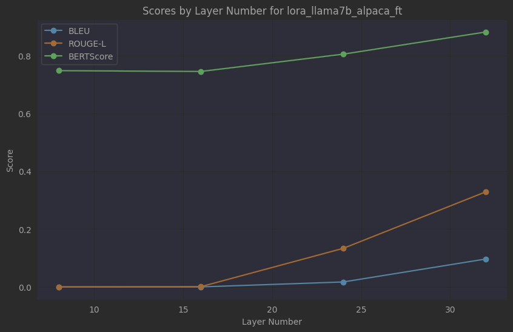
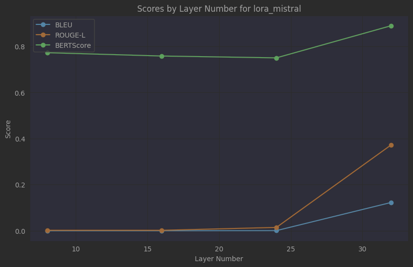

# LLM Experimentation: PII Instruction Tuning Dataset
The code is a Python script that creates a personal identifiable information dataset based on several BERT PII datasets. We then train a Llama 3 8B model on the PII dataset and evaluate it's performance.
## Language Model Text Generation and Evaluation

This notebook contains a Python script for text generation and evaluation using various transformer-based language models. It leverages the Hugging Face Transformers library for model loading, tokenization, and generation tasks.

### Prerequisites

- Python 3.6+
- PyTorch
- Hugging Face Transformers
- NLTK
- Rouge Score
- BERT Score
- Datasets
- tqdm
- matplotlib

Install the required packages using:

```bash
pip install torch transformers nltk rouge-score bert-score datasets tqdm matplotlib
```

### Code Overview

The script provides functionality for:

1. **Text Generation**: Generating text completions from language models.
2. **Text Evaluation**: Evaluating generated text against reference outputs using BLEU, ROUGE-L, and BERTScore metrics.
3. **Model Loading and Usage**: Loading pre-trained language models (GPT-2, LLM models) and leveraging them for text generation.
4. **Dataset Loading**: Loading datasets for training and testing text generation models.

### Usage

1. **Import Libraries**:
   
   Start by importing the necessary libraries and modules:

   ```python
   import torch.nn.functional as F
   from transformers import AutoTokenizer, AutoModelForCausalLM
   from transformers.tokenization_utils_base import BatchEncoding
   import torch
   import logging
   import matplotlib.pyplot as plt
   from nltk.translate.bleu_score import SmoothingFunction, sentence_bleu
   from rouge_score import rouge_scorer
   from bert_score import score
   from datasets import load_dataset, load_metric
   from tqdm.auto import tqdm
   import json
   from peft import AutoPeftModelForCausalLM
   ```

2. **Define Functions**:

   - `calculate_bleu`: Calculate BLEU score between a reference and a candidate text.
   - `calculate_rouge_l`: Calculate ROUGE-L score between a reference and a candidate text.
   - `calculate_bert_score`: Calculate BERTScore between a reference and a candidate text.
   - `evaluate_text_quality`: Evaluate text quality using BLEU, ROUGE-L, and BERTScore.
   - `calculate_scores`: Calculate average evaluation scores over a test dataset.
   - `generate_text`: Generate text using a language model with specified parameters.
   - `format_prompt`: Format a prompt with instruction, input, and output sections.
   - `generate_responses`: Generate responses for a dataset using a language model.
   
3. **Model and Dataset Configuration**:

   Configure the models to be used (`normal_models` and `lora_models`) along with dataset loading and splitting.

4. **Run Text Generation and Evaluation**:

   Loop through the specified models and configurations, generate responses, evaluate them against the test dataset, and save the results to a JSON file.

## Results

Three models are being compared here: **Llama2 7B Fine-Tuned**, **Phi2 2.5B Fine-Tuned**, and **Mistral Fine-Tuned**. For each model, the outputs from four different layers (8, 16, 24, and 32) are evaluated using three metrics: **BLEU**, **Rouge-L**, and **BERTScore**.

1. **Llama2 7B Fine-Tuned**: The BERTScore improves significantly from layer 8 to layer 32, indicating that the model's output becomes more semantically similar to the reference text as we move deeper into the network. The BLEU and Rouge-L scores also increase, suggesting an improvement in the quality of the generated text.

2. **Phi2 2.5B Fine-Tuned**: Similar to the Llama2 model, the BERTScore for the Phi2 model also improves from layer 8 to layer 32. The BLEU and Rouge-L scores show a noticeable increase, indicating that the quality of the generated text improves as we move to the deeper layers.

3. **Mistral Fine-Tuned**: The BERTScore for the Mistral model shows a significant increase from layer 8 to layer 32. The BLEU and Rouge-L scores also increase, suggesting that the deeper layers generate higher quality text.

The charts visualize these improvements across the layers. As we move from the early layers to the mature layers, the scores across each metric increase. This suggests that the outputs of the mature layers are more factual and consistent, leading to higher quality generated text.

These results provide valuable insights into how the different layers in the decoder of a language model contribute to the factuality of the generated text. They suggest that the deeper layers play a crucial role in ensuring the factuality and consistency of the output, which has important implications for the development and fine-tuning of language models. However, more research is needed to further understand the mechanisms behind these findings and to explore ways to leverage them to improve the performance of language models.


| Model Name | Layer | BLEU | Rouge-L | BERTScore |
|------------|-------|------|---------|-----------|
| Llama2 7B Fine-Tuned     |       |      |         |          
|            |Layer 8|0.0    |0.0        |0.771          |
|           |Layer 16|0.0   |0.001        |0.762         |
|           |Layer 24|0.017   |0.133        |0.805          |
|           |Layer 32|0.096   |0.329        |0.882          |

| Model Name | Layer | BLEU | Rouge-L | BERTScore |
|------------|-------|------|---------|-----------|
| Phi2 2.5B Fine-Tuned     |       |      |         |
|            |Layer 8|4.34-05    |0.009        |0.771          |
|           |Layer 16|7.45-04   |0.034        |0.762         |
|           |Layer 24|0.004   |0.072        |0.794          |
|           |Layer 32|0.108   |0.302        |0.857          |

| Model Name | Layer | BLEU | Rouge-L | BERTScore |
|------------|-------|------|---------|-----------|
| Mistral Fine-Tuned     |       |      |         |
|            |Layer 8|0.0    |0.002        |0.772         |
|           |Layer 16|0.0   |0.002        |0.758         |
|           |Layer 24|0.001   |0.014        |0.75          |
|           |Layer 32|0.123    |0.372        |0.889          |






## References

- [Hugging Face Transformers Documentation](https://huggingface.co/transformers/)
- [NLTK Documentation](https://www.nltk.org/)
- [Rouge Score Documentation](https://github.com/google-research/google-research/tree/master/rouge)
- [BERT Score Documentation](https://github.com/Tiiiger/bert_score)
- [Datasets Library Documentation](https://huggingface.co/docs/datasets/)
- [tqdm Documentation](https://github.com/tqdm/tqdm)

## Notes

- Ensure that you have compatible GPU resources if using CUDA for model acceleration (`device = 'cuda'`).
- Experiment with different model configurations (layer, temperature, top_k) for text generation.
- Adjust the dataset and model paths/configurations according to your specific use case.

For further details, refer to the inline comments and documentation within the provided Python script.
